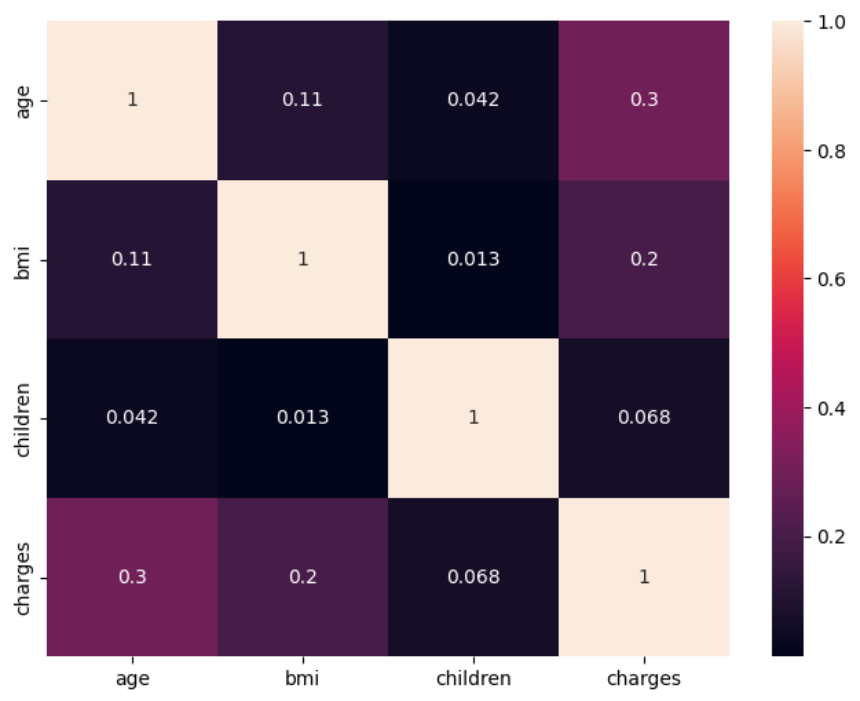
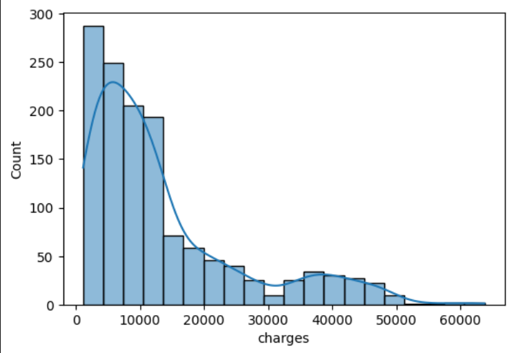
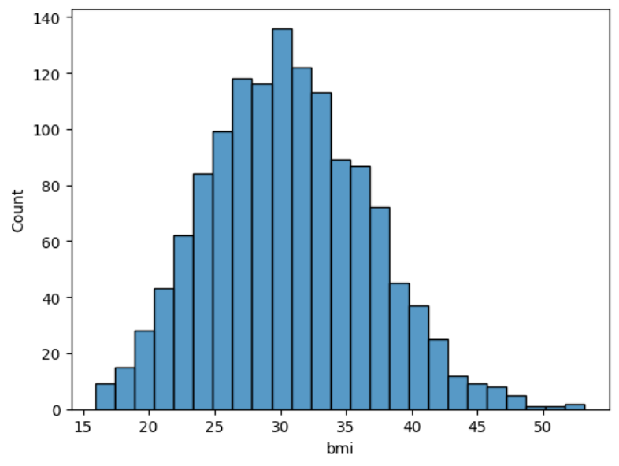

# Medical Insurance Cost Analysis
Exploratory data analysis and statistical analysis of medical insurance costs using Python.

## Project Overview
This project analyzes medical insurance data to understand patterns and relationships between demographic factors and insurance charges.

## Key Areas -
Data Exploration - Data Cleaning - Missing Value Analysis - Duplicate Analysis - Exploratory Data Analysis - Feature Engineering - Categorical Encoding - BMI Categorization - Correlation Analysis - Pearson Correlation - Chi-Square Testing - Feature Selection ## Technologies Used - Python - Pandas - NumPy - Matplotlib - Seaborn - SciPy - Scikit-learn - Jupyter Notebook 

## Project Status
EDA and statistical analysis completed. Machine learning prediction pipeline is planned as the next phase. 

## Author
Saksham

#key visuals

